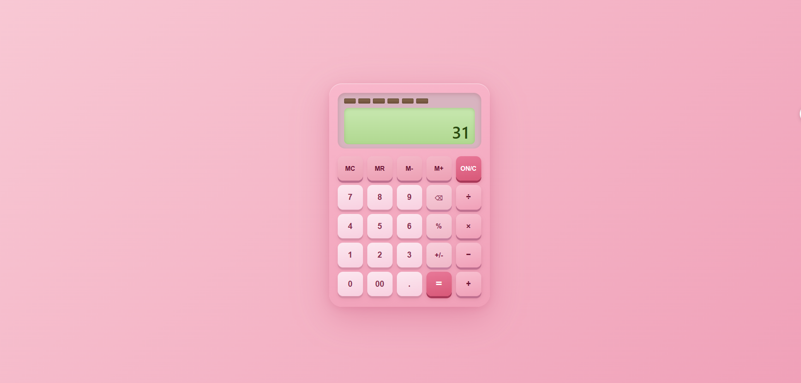

# Pink Calculator

A fully functional calculator built with vanilla HTML, CSS, and JavaScript — designed with a pink aesthetic inspired by a physical desktop calculator, tailored for everyday use by market traders.

## Preview



## Features

- Basic arithmetic: addition, subtraction, multiplication, division
- `00` button for fast entry of large naira amounts
- Percentage (`%`) — works standalone or relative to a base (e.g. `200 + 10%` = 220)
- Sign toggle (`+/-`)
- Backspace (`⌫`) to delete the last digit
- Memory functions: `MC`, `MR`, `M+`, `M-`
- Chained operations (evaluates left to right before applying next operator)
- Division-by-zero guard with shake error animation
- Auto-shrinking font for long numbers
- Full keyboard support

## Keyboard Shortcuts

| Key | Action |
|-----|--------|
| `0–9` | Digit input |
| `.` | Decimal point |
| `+` `-` `*` `/` | Operators |
| `%` | Percent |
| `Enter` or `=` | Equals |
| `Backspace` | Delete last digit |
| `Escape` or `Delete` | Clear (ON/C) |

## Project Structure

```
Project/
├── index.html       # Markup and button layout
├── style.css        # Pink UI theme and responsive styles
├── calculator.js    # All calculator logic (state machine)
```

## Getting Started

No build tools or dependencies required. Just open `index.html` in any modern browser.

```bash
# Clone the repo and open directly
open Project/index.html
```

## Tech Stack

- HTML5
- CSS3 (Grid, custom properties, keyframe animations)
- Vanilla JavaScript (ES6+)
